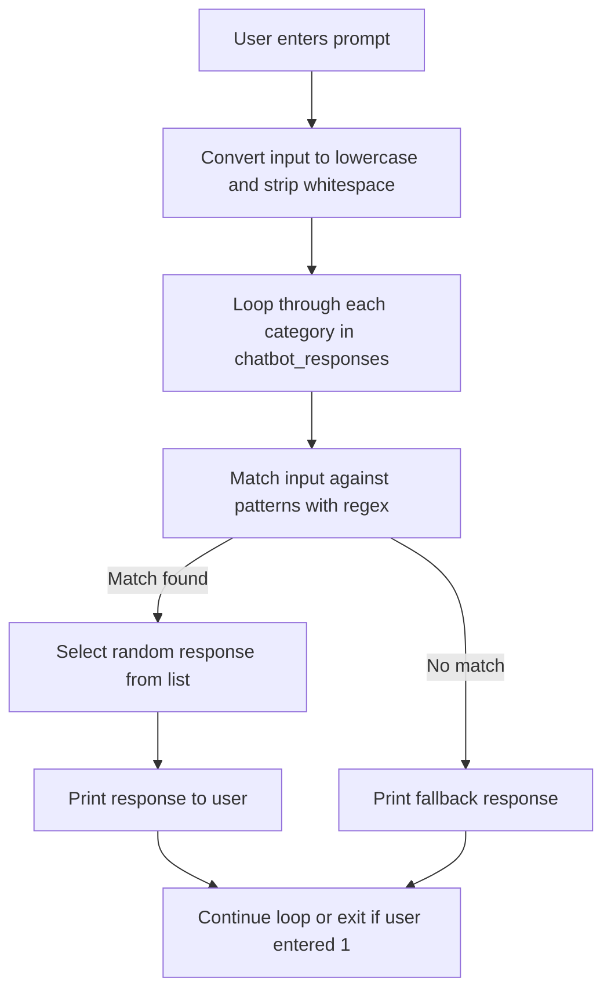

# main.py — Simple Preprogrammed AI Chatbot

This file implements a basic, preprogrammed AI chatbot in Python. The chatbot recognizes user input patterns (using regular expressions) for greetings, farewells, asking the bot's name, help requests, and jokes. It replies with a random response from a set of predefined options for each category. If it doesn't recognize the input, it prompts the user to try again.

---

## General Overview

- **Purpose:** Offer a simple conversational interface using pattern matching.
- **Techniques:** Uses regular expressions for input recognition and random selection for varied responses.
- **Scope:** Handles greetings, farewells, name inquiries, help requests, and jokes.

---

## Key Features

- Pattern-based input recognition using regular expressions.
- Randomized, pre-written responses for each recognized intent.
- Simple, text-based user interaction loop.
- Easy to extend: just add new patterns and responses.

---

## How This Preprogrammed AI Was Made

The AI follows a rule-based approach:

1. **Pattern Matching:** Regular expressions are used to match user input to predefined intents.
2. **Categorized Knowledge:** Intents (like greetings or jokes) are stored as categories, each with associated patterns and responses.
3. **Random Responses:** When an intent matches, the bot chooses a random response from that category, making conversations less repetitive.
4. **User Loop:** The interface is a persistent loop, letting the user chat until they enter '1' to exit.

```card
{
    "title": "Rule-Based AI Design",
    "content": "This chatbot uses pattern matching with regular expressions to simulate simple conversational AI behavior."
}
```

---

## Main Components and Their Roles

| Component                | Description                                                                 |
|--------------------------|-----------------------------------------------------------------------------|
| `chatbot_responses`      | Dictionary mapping intent names to patterns (regexes) and response lists.   |
| `bot_response()`         | Function that processes user input, matches patterns, and prints a response.|
| Input loop (while block) | Repeatedly prompts the user for input until '1' is entered to quit.         |

---

## Detailed Code Walkthrough

### 1. Intent Definitions

Each conversational intent is defined with:

- **Patterns:** List of regex patterns to recognize the intent.
- **Responses:** List of possible responses.

```python
chatbot_responses = {
    "greeting": {
        "patterns": [
            r"hello|hi|hey|good morning|good afternoon|good evening",
            r"how are you|how's it going|what's up"
        ],
        "responses": [
            "Hello! How can I help you today?",
            "Hi there! What's on your mind?",
            "Hey! Nice to see you. How can I assist?",
            "Good day! I'm here to help with any questions."
        ]
    },
    # ... other categories omitted for brevity
}
```

- **Extensible:** Easily add new intents by adding more dictionary entries.

---

### 2. The Response Logic

The core response function processes input, searches for intent matches, and returns an appropriate message.

```python
def bot_response(prompt):
    prompt = prompt.lower().strip()
    for category, data in chatbot_responses.items():
        patterns = data["patterns"]
        responses = data["responses"]
        for pattern in patterns:
            if re.search(pattern, prompt):
                print(random.choice(responses))
                return
    print("I don't have a response for that yet. Try asking about greetings, help, or tell me a joke!")
```

- **Lowercasing and stripping**: Normalizes user input.
- **Pattern matching**: Iterates over each intent and its patterns.
- **Random response**: Uses `random.choice()` for variety.
- **Fallback**: If no match, prints a default message.

---

### 3. Main Input Loop

The loop keeps the chatbot running until the user enters '1' to quit.

```python
exit_ai = 0
while exit_ai == 0:
    print("Enter 1 to leave the AI")
    prompt = input("Enter a prompt for the AI: ")
    if prompt == "1":
        exit_ai = 1
        print("Left the Ai, Thanks for using it.")
    else:
        bot_response(prompt)
```

- **User interaction**: Asks for input, checks for the quit signal.
- **Session control**: Exits cleanly when '1' is entered.

---

### How the AI Processes User Input



---

### Example Usage

#### Conversation Example

```plaintext
Enter 1 to leave the AI
Enter a prompt for the AI: Hi
Hey! Nice to see you. How can I assist?

Enter 1 to leave the AI
Enter a prompt for the AI: Tell me a joke
What do you call fake spaghetti? An impasta!

Enter 1 to leave the AI
Enter a prompt for the AI: 1
Left the Ai, Thanks for using it.
```

---

## Extending the Chatbot

To add new capabilities:

1. Add a new key to `chatbot_responses` with appropriate patterns and responses.
2. The `bot_response` function will automatically include the new category.

---

## Pros and Cons

- **Pros:**
  - Simple, understandable logic.
  - No external dependencies beyond the standard library.
  - Easy to extend with new patterns and responses.
- **Cons:**
  - Not context-aware; doesn't remember previous interactions.
  - Limited to recognizing only defined patterns (no learning).
  - Regex patterns may occasionally cause unexpected matches.

---

## Example Intent Table

| Intent    | Example User Input     | Example Bot Response                                  |
|-----------|-----------------------|-------------------------------------------------------|
| greeting  | "Hello"               | "Hey! Nice to see you. How can I assist?"             |
| goodbye   | "Goodbye"             | "See you later! Take care!"                           |
| name      | "What's your name?"   | "I'm Grok, your helpful AI assistant!"                |
| help      | "Can you help me?"    | "I can help with general questions, provide information, and chat about various topics. Just ask me anything!" |
| jokes     | "Tell me a joke"      | "Why don't scientists trust atoms? Because they make up everything!" |

---

## Summary

This simple AI chatbot demonstrates a foundational approach to dialogue systems. It uses regular expressions to categorize user input and replies with a random answer from a set list. This approach is ideal for quick prototypes, demos, or educational tools.

```card
{
    "title": "Best Practice",
    "content": "To improve, consider adding logging, more nuanced intent detection, or integrating with NLP libraries."
}
```
